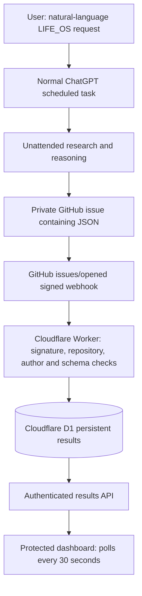

# Life OS POC — accepted baseline

**POC STATUS: WORKAROUND SUCCESS — ACCEPTED**

Acceptance and lock-down date: **2026-09-24**. Branch: `lifeos-poc`. Tag: `lifeos-poc-v1.0-accepted`. Resolve the exact verified commit with `git rev-parse 'lifeos-poc-v1.0-accepted^{commit}'`. Never move or reuse this tag. [Draft PR #1](https://github.com/mb-projectlantern/projectlantern/pull/1) remains unmerged. This is the authoritative technical record; `LIFE_OS_V1_HANDOFF.md` is a technical handoff, not a V1 specification.

## Purpose and original hypothesis

Determine whether normal ChatGPT, using the existing subscription and scheduled tasks, can perform work unattended and automatically persist/display its result in Life OS without manual transfer or paid OpenAI API inference. A private GitHub issue is the intentional POC bridge. This is **not** direct ChatGPT-to-Life-OS API integration. Experimentation is complete. No V1 functionality is included.

## Final live acceptance test

| Field | Accepted evidence |
| --- | --- |
| Date / test | 2026-09-24 / AMZN 24-Hour Brief |
| Type | Live scheduled ChatGPT research execution |
| User interaction | Natural-language request from a **new normal ChatGPT conversation**, naturally referencing LIFE_OS |
| Approximate request | “Five minutes from now, research AMZN for developments from the last 24 hours. Check current/recent market information and credible news sources. Identify the single most important development affecting Amazon, if one exists. Also integrate this with my LIFE_OS system.” |
| Plumbing specified by user | None: no repository, JSON, schema, webhook, Cloudflare, storage, endpoint, or dashboard instructions |
| Execution | Unattended; live research/reasoning; COMPLETED; NEEDS ATTENTION |
| Executed | Approximately 10:53:21 AM Eastern; stored timestamp `2026-09-24T14:53:21.723Z` |
| Received | Approximately 10:53:24 AM Eastern; server timestamp `2026-09-24T14:53:24.024Z` |
| Handoff | Approximately 3 seconds; precise timestamp difference 2.301 seconds. One observation, not a latency guarantee. |
| Private issue | [lifeos-results #4](https://github.com/mb-projectlantern/lifeos-results/issues/4), created `2026-09-24T14:53:22Z` |
| External identifier | `github:1385602767:4` |
| Persistent record | `2955e18f-1baa-4588-9a70-7203f15232fe`; `processing_status=stored` |
| Webhook | issues/opened returned HTTP 201; delivery timestamp `2026-09-24T14:53:24.419Z` |
| Manual transfer / OpenAI API inference | NONE / NONE |
| Result | SUCCESS; user confirmed automatic display in the protected dashboard |

The user confirmed that ChatGPT resolved LIFE_OS, scheduled/executed the task unattended, researched current/recent market context and Reuters reporting, and supplied a conclusion, source URLs, publication/event timing, caveats, and execution timestamp. The lock-down audit independently compared the existing issue's summary/details to the stored record and verified authenticated retrieval. Private research text/source URLs are not copied into this public repository; only user-authorized acceptance metadata is recorded. The new acceptance conversation URL was not supplied; the issue and persistent record are durable technical evidence.

**Acceptance conclusion:** a user can issue a natural-language instruction in normal ChatGPT, request LIFE_OS integration, allow it to execute later without involvement, and have AI-generated research automatically persisted and displayed in Life OS.

**Provenance limitation:** Life OS verifies GitHub's signed webhook, configured private repository, and allowlisted sender/issue author. It does **not** cryptographically verify ChatGPT authorship. The stored/displayed source remains **`GitHub issue (ChatGPT origin unverified)`**.

Earlier interactive ChatGPT [issue #2](https://github.com/mb-projectlantern/lifeos-results/issues/2) reached storage at `2026-09-24T14:11:41.447Z`; synthetic scheduled ChatGPT [issue #3](https://github.com/mb-projectlantern/lifeos-results/issues/3) reached storage at `2026-09-24T14:17:36.498Z`. [Earlier synthetic conversation](https://chatgpt.com/c/6ab52e2a-0d14-83e8-b4d5-bfec2d23c98e). That earlier scheduled run was about 2m25s late. Final acceptance supersedes its synthetic-only limitation but does not prove multi-day reliability or general research accuracy. The proposed five-day AMZN schedule was not created by this project work. Lock-down creates no new scheduled task.

## Architecture and exact flow



1. ChatGPT resolves the account's LIFE_OS convention and uses its authorized GitHub write action after scheduled execution. Interactive publishing also works in the observed account.
2. GitHub POSTs to `/life-os/api/github`; HMAC-SHA256 checks the original body bytes using `X-Hub-Signature-256`.
3. The Worker requires the configured private repository ID and allowlisted sender **and** issue author. Only `[life-os]` titles and opened events produce results. Edits are ignored; authenticated irrelevant events return 202.
4. The adapter assigns `external_id=github:<repository-id>:<issue-number>` and the provenance label. `TEST DATA` remains visibly synthetic.
5. Shared ingestion validates/inserts the row into D1. Unique `external_id` plus `ON CONFLICT DO NOTHING` provides idempotency: first insert 201, duplicate 200 with original record ID.
6. Page/assets/read API require HTTP Basic over HTTPS. The dashboard fetches newest results immediately, on refresh, and every 30 seconds. Content renders with `textContent`, not interpreted HTML.

## Repository roles and deployed inventory

| Component | Accepted configuration |
| --- | --- |
| Public source | `mb-projectlantern/projectlantern`, `lifeos-poc`; source, synthetic tests, sanitized technical docs only |
| Public website | GitHub Pages `main:/`, CNAME `www.projectlantern.net`; built; unchanged main `923f8e0ecb6c6c39961c98b15bd6b2731825abf9` |
| Private bridge | `mb-projectlantern/lifeos-results`, ID `1385602767`; PRIVATE; README commit `9aedd8f06210724e0f956126a7f90c0f6aa14eba` and four issues at audit |
| Worker | `project-lantern-life-os-poc`, existing Cloudflare Free account |
| Accepted deployed version | `01d637a8-74ac-4c9d-9e26-0bb194b821e2`, 100%, created `2026-09-24T14:11:53.266Z`; no lock-down redeployment |
| Dashboard | https://project-lantern-life-os-poc.mb-projectlantern.workers.dev/life-os/ |
| Webhook | `684955308`, active, Issues events, JSON, TLS verification enabled (`insecure_ssl=0`) |
| Webhook URL | `https://project-lantern-life-os-poc.mb-projectlantern.workers.dev/life-os/api/github` |
| D1 | `life-os-poc`, ID `d4a11f01-94c3-452c-98f9-d4e25926c75c`, binding `DB`, region ENAM |
| Stored state | Five results, five distinct external IDs; approximately 45.1 kB; accepted AMZN record present |

The preview domain is intentional. No DNS migration, public-site route change, Pages deployment, or merge is needed. Git does not deploy the Worker or back up D1.

## Source map and persistent storage

- `life-os/worker.js`: authentication, validation/limits, protected routes, D1 insertion/read, metadata logs.
- `life-os/github.js`: signed issue adapter and provenance label.
- `life-os/ui.js`: dashboard HTML/CSS and polling/rendering JavaScript.
- `life-os/migrations/0001_results.sql`: `results` and optional `bridge_status` tables; D1 also has migration bookkeeping.
- `life-os/access.ps1`, `credentials.ps1`, `initialize-access.ps1`: encrypted local credential recovery, verification, clipboard retrieval.
- `life-os/test/*.test.js`: regression suite; `database.js` uses real SQLite; `preview.js` is loopback-only with public test credentials.
- `life-os/synthetic.js`: explicit synthetic publisher; do not run against production for routine baseline verification.
- `life-os/bridge/gmail.gs`, `email-parser.js`: retained email prototype, **not deployed or part of acceptance**.
- `wrangler.jsonc`, package files: pinned deployment configuration/dependencies.

D1 persists independently of Worker processes/redeployments. Rows contain generated ID, unique external ID, validated fields, server receipt time, and processing status `stored`. Reads order by execution time then receipt time descending, capped at 100. No retention/deletion job exists. `bridge_status` is for the unused email fallback; its absence is normal.

## Issue/result schema and natural-language LIFE_OS convention

Issue title begins `[life-os]`; body is one JSON object, **without Markdown fences**:

| Field | Required type / limit |
| --- | --- |
| `task_name` | Nonempty string, max 160 characters |
| `task_type` | Nonempty string, max 40 |
| `subject` | Nonempty string, max 80 |
| `status` | Nonempty string, max 40; not a fixed enum |
| `requires_attention` | Boolean |
| `summary` | Nonempty string, max 2,000 |
| `details` | Nonempty string, max 20,000; include URLs, timing and caveats |
| `source` | Nonempty string, max 100; replaced with provenance label except `TEST DATA` |
| `execution_time` | ISO 8601 with explicit zone; normalized to UTC; fractional precision accepted |

GitHub supplies `external_id`; direct bearer ingestion additionally requires it as a nonempty string, max 250. Ingestion body limit: 32 KiB; webhook envelope: 128 KiB. Never include secrets. Server ID, receipt time and processing status are not caller-controlled.

The LIFE_OS convention worked from a fresh ChatGPT context in this account. Its account-level persistence mechanism was not inspected/exported; Git cannot restore personalization, app grants or tasks. Do not assume an unrelated fresh account knows it or has write permission. To re-establish it, give ChatGPT this portable contract and authorize the private bridge:

> LIFE_OS means publish each requested completed result as a new issue in PRIVATE `mb-projectlantern/lifeos-results`, title beginning `[life-os]`, body containing one JSON object using the fields/limits above. Preserve sources, timing, caveats and actual execution timestamp. Use `source="ChatGPT"`; Life OS labels provenance conservatively. Never include secrets. When I request scheduled work integrated with LIFE_OS, publish after execution using the authorized GitHub write action. If unavailable or approval-blocked, report that limitation; do not claim publication or substitute manual transfer.

This is the integration contract, not a new schedule or future behavior guarantee. Initial setup required adding the private bridge to selected-repository app permissions. Normal ChatGPT behavior is account-specific; Codex/API/ChatGPT Work capability is not substitute evidence. [Official task documentation](https://help.openai.com/en/articles/10291617-scheduled-tasks-in-chatgpt) and [GitHub app documentation](https://help.openai.com/en/articles/11145903-connecting-github-to-chatgpt) are background references; acceptance above is the observed evidence.

## Secrets and authentication

| Setting | Location / purpose |
| --- | --- |
| `DASHBOARD_USER` | Worker secret; exact username `lantern` |
| `DASHBOARD_PASSWORD` | Worker secret; minimum 24 characters; independent random password; Basic read access |
| `INGEST_TOKEN` | Worker secret; minimum 32 characters; write-only bearer credential, never sent to dashboard JS |
| `GITHUB_WEBHOOK_SECRET` | Matching Worker/private webhook secret; minimum 32 characters |
| `GITHUB_REPOSITORY_ID` | Non-secret Worker variable `1385602767` |
| `GITHUB_ACTOR` | Non-secret allowlist `mb-projectlantern`, sender and issue author |
| `DB` | D1 binding; non-secret database ID in Wrangler config |
| `LIFE_OS_URL` | Optional synthetic/email tooling origin; no embedded credentials |

Missing/short core secrets fail closed. HMAC uses Web Crypto verification. SQL uses bound parameters. Reads have no public CORS permission. Responses include no-store, CSP, frame denial, no-sniff, HSTS and no-referrer headers. Application logs contain request/status/record/delivery metadata, not passwords, Authorization headers or research bodies; direct ingestion logs caller-supplied `source`, so never place private content there. Basic authentication caches credentials in the browser; close the private browsing session to end that session. No application logout, per-user identity, MFA or rate limiter exists.

GitHub credential-manager and Wrangler OAuth credentials stay outside both repositories. Cloudflare can list secret names, not return values. Never rotate working credentials as housekeeping. Dashboard, ingestion and webhook credentials are separate.

## Local credential setup and retrieval

Windows PowerShell 5.1 is supported. Run as the Windows user who owns the credential:

```powershell
powershell.exe -NoProfile -ExecutionPolicy Bypass -File "C:\Dev\ProjectLantern\projectlantern\life-os\access.ps1" -CopyPassword
```

Bypass applies only to that process. Username: **`lantern`**. DPAPI-encrypted password: `C:\Users\mattb\.projectlantern\dashboard-credential.xml`, outside both repositories. The script verifies live authentication before copying. Paste into the dashboard prompt, then clear the clipboard; history/sync may retain passwords.

The original missing-file failure combined undocumented one-time local setup with Windows MSIX AppData redirection. Codex's apparent AppData writes physically landed in `C:\Users\mattb\AppData\Local\Packages\OpenAI.Codex_2p2nqsd0c76g0\LocalCache\Local\ProjectLantern\`, invisible at that apparent path in ordinary PowerShell. File-handle queries proved the redirection and verified the new user-profile path is unredirected. Existing credentials were recovered, not rotated.

Fresh machine/missing file/recovery:

```powershell
powershell.exe -NoProfile -ExecutionPolicy Bypass -File "C:\Dev\ProjectLantern\projectlantern\life-os\initialize-access.ps1"
```

Adjust checkout paths as needed. Initialization checks canonical/pending credentials, old AppData files, and physical `OpenAI.Codex_*` cache paths. It recovers only after live authentication. Otherwise it prompts invisibly for the known password from a password manager/original machine, creates the directory, and saves a verified dashboard-only credential. DPAPI is bound to the original Windows user/machine; copying XML is not portable password backup.

Only if recovery is impossible, append `-ResetPassword` after installing dependencies/signing into Wrangler. Recovery still runs first; otherwise it creates a random password, saves an encrypted `.pending` copy before the network operation, confirms existing secret names, updates only `DASHBOARD_PASSWORD` via Wrangler stdin, verifies authentication and saves the canonical file. No code deployment or ingestion/webhook changes occur. Retain `.pending` after interruption and rerun initialization. A network outage is not a reason to reset.

## Deployment prerequisites and procedure

Required: existing ChatGPT subscription, authorized GitHub write action/private bridge, Cloudflare Free Workers/D1, Node >=22.13 and pnpm. Verified runtime: Node 24.19.0; Wrangler pinned to 4.136.3. Use the lockfile; do not upgrade while reproducing the baseline.

For existing infrastructure, reuse D1/secrets. For a **genuinely new installation only**:

```sh
pnpm install --frozen-lockfile
pnpm test
pnpm exec wrangler login
pnpm exec wrangler d1 create life-os-poc
# Set the returned non-secret D1 ID in wrangler.jsonc for this new installation.
pnpm exec wrangler d1 migrations apply life-os-poc --remote
pnpm exec wrangler secret put DASHBOARD_USER
pnpm exec wrangler secret put DASHBOARD_PASSWORD
pnpm exec wrangler secret put INGEST_TOKEN
pnpm exec wrangler secret put GITHUB_WEBHOOK_SECRET
pnpm exec wrangler deploy
```

Enter secrets through CLI prompts/protected secret handling, never command arguments, source, issues or task messages. Use `lantern` and independent high-entropy values (32 random bytes encoded as hex is sufficient). Initialize local access with that same password. A replacement private repository requires deliberate ID/actor updates. Configure its webhook to the documented URL, Issues only, JSON, TLS verification enabled, matching secret. Do not create a duplicate webhook or rerun initial secret setup on the existing deployment.

## Verification and security audit

Complete regression command:

```sh
node --test life-os/test/*.test.js
# Equivalent package script: pnpm test
```

**Final result: 15 tests, 15 passed, 0 failed, 0 skipped, 0 cancelled.** Six integration/parser tests cover timestamps; ingestion/persistence after SQLite reopen; ordering and actual UI rendering/polling; auth boundaries; malformed/oversized input and storage failures; signed webhook/replay/private-repo/actor checks; synthetic handling; and the unused email parser. Nine Windows credential tests cover missing/corrupt files, legacy/package recovery, fresh import, mismatches, reset ordering, interruption and pending recovery. Isolated SQLite/DPAPI fixtures and mocked Cloudflare/clipboard boundaries create no live issues.

Read-only live audit confirmed:

- Worker version and all four secret names present; no redeployment/rotation.
- D1 reads succeed: five records/five unique IDs; accepted record matches issue #4 summary/details.
- Page, JS, CSS and results API: anonymous 401, existing credential 200.
- Webhook active with TLS verification; acceptance delivery 201; earlier interactive/scheduled deliveries successful.
- User accepted actual dashboard display; automated test confirms safe rendering and 30-second polling.
- Public Pages built from unchanged main; private bridge PRIVATE; PR draft/unmerged.
- No new live issue, synthetic production write, schema change or scheduled task during lock-down.

The focused security scan inspected all **33 reachable public Git blobs before the documentation commit**, including POC history, tracked/config/doc/test files, plus the private repo's one README blob, four issues and zero comments. Six existing sensitive values (dashboard password, ingestion token, webhook secret, GitHub credential, Wrangler OAuth/refresh credentials) were compared in memory without printing/saving them. Token/private-key patterns and manual review of credential references found no exposed secrets. Public test/preview literals differ from production. Private AMZN summary/details were compared against public history with no matches; no private monitoring payload is committed. Final docs are scanned before tagging. This is a focused audit, not proof of detecting every unknown secret format.

Ignore coverage includes `.env*`, `.dev.vars*`, `.wrangler/`, dependencies, SQLite/test-output, local encrypted credentials/pending copies, logs, private-key/certificate containers and private backup folders. Production credentials, private keys, research payloads and real log dumps belong in neither repository. No defect required a runtime change; lock-down changes only documentation and ignore coverage.

## Backup, rollback and recovery

Git preserves source/documentation, **not** D1 data, secrets, account permissions or ChatGPT state. A verified D1 export containing the acceptance record is DPAPI-encrypted at:

`C:\Users\mattb\.projectlantern\backups\lifeos-poc-accepted-2026-09-24.sql.dpapi.xml`

Temporary plaintext SQL was deleted after encryption/round-trip verification. Recovery needs the original Windows user/machine. Keep a separately secured portable backup before retiring that machine; neither Git repository is a destination for private data backups.

Recover source without touching main:

```sh
git fetch origin --tags
git rev-parse 'lifeos-poc-v1.0-accepted^{commit}'
git switch --detach lifeos-poc-v1.0-accepted
pnpm install --frozen-lockfile
pnpm test
```

Use a separate checkout if uncommitted work exists. Never force-update this tag. Record its resolved SHA independently; Git tags are technically movable, so this tag is immutable by policy.

If a later **Worker-only** deployment fails, inspect `pnpm exec wrangler deployments list`. If the accepted version is available and compatible with current bindings/secrets:

```sh
pnpm exec wrangler rollback 01d637a8-74ac-4c9d-9e26-0bb194b821e2
```

Alternatively deploy tagged source with existing config/bindings/secrets via `pnpm exec wrangler deploy`, after checking the target account. Neither restores database contents. Do not recreate/delete D1 or rerun secret setup just to roll back code. Verify anonymous 401, authenticated 200 and the existing acceptance record; no new live issue is needed.

Before database recovery, deliberately stop conflicting writes and export current state privately; prefer testing in a separate database. D1 Time Travel retains 7 days on Free (30 on Paid), not a permanent baseline archive. Select a point before corruption using Cloudflare's dashboard/official instructions; newer writes will be lost. [D1 Time Travel](https://developers.cloudflare.com/d1/reference/time-travel/).

To decrypt the local export under the original Windows account/machine into a private location outside Git:

```powershell
$backup = 'C:\Users\mattb\.projectlantern\backups\lifeos-poc-accepted-2026-09-24.sql.dpapi.xml'
$restoreSql = 'C:\Users\mattb\.projectlantern\backups\restore-private.sql'
$secureSql = Import-Clixml -LiteralPath $backup
[IO.File]::WriteAllText($restoreSql, [Net.NetworkCredential]::new('', $secureSql).Password)
```

Import into a separately provisioned empty recovery database using `pnpm exec wrangler d1 execute <recovery-database-name> --remote --file <private-sql-path>`. Validate schema, count and acceptance ID before a deliberate binding switch; delete plaintext SQL afterward. Do not import blindly into populated production. No restore/rollback was performed during lock-down.

For missed delivery after correcting its failure, redeliver the **original opened event** in GitHub Recent deliveries. Unique external IDs make successful replays idempotent. Editing an issue does not re-ingest it. Dashboard access failures use initialization; webhook secret loss requires coordinated GitHub/Worker repair, not dashboard reset.

## Troubleshooting

| Symptom | Check |
| --- | --- |
| No scheduled execution | ChatGPT task schedule/status, limits, approvals; timing not guaranteed |
| Output but no issue | Write-action availability and selected-repository grant; confirm actual issue URL |
| Issue but no result | Recent deliveries: 401 signature, 403 repo/author, 400 payload/schema, 503 config/storage; metadata logs |
| Duplicate delivery | 200 with original record ID is expected; no new row |
| Dashboard 401 / 503 | Credential mismatch / missing configuration or unavailable storage |
| Missing local credential | Initialization also checks physical Codex cache; retain current user-profile path |
| DPAPI decryption fails | Use original account/machine or securely import known password on the new machine |
| Script execution blocked | Use process-only `powershell.exe -ExecutionPolicy Bypass -File ...` above |
| Row but no card | Authenticated results API, connection status, browser errors, newest-100 cap, polling interval |
| Stale display | Check network/authentication before altering storage |
| Email bridge status absent | Expected: fallback is not deployed |

## Costs, dependencies, limitations and technical debt

No paid OpenAI API inference, GitHub Actions runner or new paid infrastructure was enabled. Existing ChatGPT subscription/domain costs remain outside the POC. Incremental hosting is expected to cost $0 on Free within quotas; this audit did not retrieve a billing invoice. A paid-plan upgrade, larger workload, subscription/domain changes or separately deployed services could create recurring charges. No paid upgrade occurred.

Checked 2026-09-24: Workers Free allows 100,000 requests/day and 10 ms CPU/invocation. D1 Free allows 5 million rows read/day, 100,000 written/day and 5 GB total storage. A continuously open dashboard makes about 2,880 polls/day, potentially returning 100 rows each. Monitor actual usage and plan settings; quota exhaustion can interrupt service. [Workers pricing](https://developers.cloudflare.com/workers/platform/pricing/), [D1 pricing](https://developers.cloudflare.com/d1/platform/pricing/).

Actual retained limitations/debt:

- GitHub is the intermediary/message bus; GitHub source does not independently prove ChatGPT authorship.
- Fresh-context convention resolution/unattended writes are observed for this account, not guaranteed universally. ChatGPT permissions and convention persistence are external dependencies.
- Scheduling can be late; one research run does not prove five-day reliability or independently validate financial conclusions. No trading exists.
- Basic auth lacks application logout, MFA, per-user roles and throttling. Clipboard/DPAPI portability limitations remain.
- Newest 100 records only; no pagination, retention, automatic reconciliation, delivery-failure alerting or scheduled independent backups. Baseline backup is manual/machine-bound.
- Edits ignored; uniqueness handles replay but there is no independent event ledger/repair queue.
- No direct ChatGPT API integration, inference key or paid API fallback. Gmail prototype is unactivated; actual email format/unattended integration remains unproven.
- Service logs/delivery history have provider-managed retention. Git alone cannot restore accounts or data.

These boundaries are not permission to begin V1. Preserve the accepted POC; the product specification comes separately.
